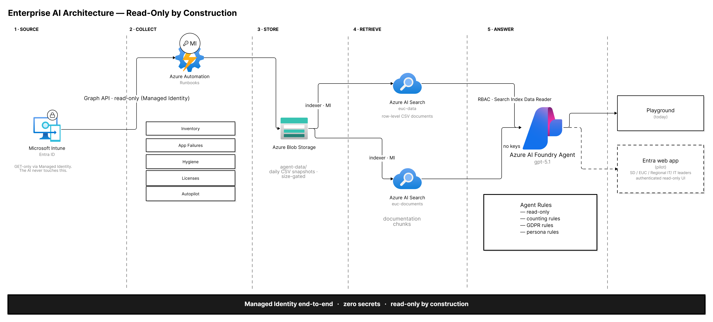
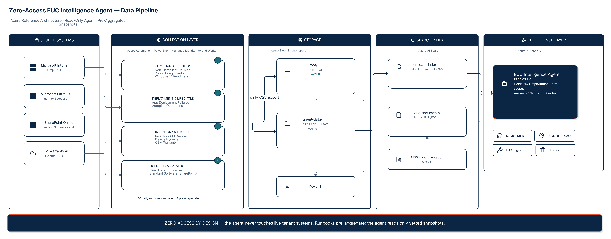

# zero-access-agent

**Modern Workspace Endpoint Intelligence — the Zero-Access Pattern.**
An AI agent that answers questions about an endpoint fleet — while holding **no
access to any live system**. Managed Identity end-to-end · zero secrets · read-only
by construction.

---

## The problem

The obvious way to build "an AI that answers questions about your fleet" is to hand it
credentials: a Graph app registration, some scopes, maybe a key, and let it call live
whenever someone asks. That wires a probabilistic system straight into your production
tenant. Every prompt becomes a potential live call; every agent loop is a permission you
now have to trust, audit, and rotate. A confused agent, a prompt-injected document, or a
runaway loop is no longer a bad answer — it's a bad answer *with standing access to your
directory*.

## The pattern

Separate **collecting the data** from **answering questions about it**, and give the
answering side nothing to call.

A set of read-only jobs export point-in-time **snapshots** of the fleet on a schedule.
Those snapshots are pre-aggregated and indexed. The agent answers **only from the index**
— it holds no Graph, Intune, or Entra scopes and no keys. The permission boundary is
enforced by *architecture*, not by asking the model to behave. There is no live path from
the agent to the tenant.

```
 1 · SOURCE            2 · COLLECT               3 · STORE              4 · RETRIEVE            5 · ANSWER
 Intune / Entra   →   Azure Automation      →   Blob: daily CSV    →   Azure AI Search    →   AI Foundry agent
 (read-only via        runbooks                  snapshots               two indexes:            holds NO tenant
  Managed Identity)    (Managed Identity,         · full CSVs (BI)        · row-level data        scopes, no keys;
                       read-only Graph;           · slim, pre-             · doc chunks            answers ONLY
 the AI never          collect + pre-aggregate)    aggregated + _Stats                            from the index
 touches this ────────────────────────────────────────────────────────────────────────────────────►│
                                                                                                     ▼
                                                                                            consumers (read-only UI)

        Managed Identity end-to-end   ·   zero secrets   ·   read-only by construction
```

### The five stages

1. **Source — read-only, and the AI never touches it.** Microsoft Intune / Entra ID.
   Everything downstream is GET-only via Managed Identity.
2. **Collect — runbooks that pre-aggregate.** Scheduled Azure Automation runbooks
   (PowerShell, Managed Identity) pull read-only from Graph and write CSVs. They don't
   just dump rows — they *pre-aggregate* into slim CSVs plus `_Stats` summaries, so the
   expensive shaping happens once, in a trusted job, not at query time in the agent.
   Grouped by concern: compliance & policy, deployment & lifecycle, inventory & hygiene,
   licensing & catalog.
3. **Store — snapshots, size-gated.** Azure Blob. `root/` keeps the full CSVs (these also
   feed Power BI dashboards); `agent-data/` keeps the slim, pre-aggregated snapshots the
   agent will read. Daily export; size-gated so a snapshot can't balloon unbounded.
4. **Retrieve — two indexes, RBAC read-only.** Azure AI Search over the snapshots: one
   index for the structured, row-level CSV data, one for documentation chunks. Access is
   RBAC (Search Index Data Reader) — read, never write.
5. **Answer — an agent with no scopes.** An Azure AI Foundry agent answers from the index
   only. It holds **no** Graph/Intune/Entra permissions and **no** keys. Its behavior is
   pinned by explicit **Agent Rules**: read-only, counting rules (count *devices*, not
   *rows*), GDPR handling, and persona. Answers surface in a read-only UI for the people
   who need them.

## Architecture



*Read-only by construction — Managed Identity end-to-end, zero secrets, and an agent that holds no tenant scopes and answers only from the index.*



*The data pipeline — read-only runbooks pre-aggregate daily CSV snapshots into an index; the agent reads only vetted snapshots, never the live tenant.*

## Why the boundary holds

- **The agent has nothing to call.** No scopes, no keys. Worst case is a wrong answer from
  a snapshot — never an action against the tenant.
- **Managed Identity end-to-end, zero secrets.** No app secrets or keys to leak, rotate,
  or find committed in history. Identity is brokered, not stored.
- **Pre-aggregation is a trust boundary too.** Shaping happens in a reviewed runbook, so
  the agent reads vetted, consistent snapshots instead of improvising math over raw rows.
- **Injection can't escalate.** A malicious document in the corpus can bias an *answer*,
  but there is no tool for it to call and no scope for it to abuse.
- **Everything is auditable.** What the agent saw is a dated, diffable CSV snapshot.

It trades freshness for containment: snapshots are as current as the last run, not live.
That trade is the whole point. See *What this isn't*.

## What's in this repo (roadmap)

This repo documents the pattern and ships the reusable pieces one at a time, each with a
companion write-up. Modules use generic names and synthetic examples.

1. **Runbook patterns** — the read-only, pre-aggregating collector shapes (the "slim CSV +
   `_Stats`" convention), generic and tenant-free.
2. **Snapshot layout** — the Blob `root/` vs `agent-data/` split and the size-gating rule.
3. **Index + agent config** — the two-index AI Search setup and the Agent Rules
   (read-only, counting, GDPR, persona) that keep answers honest.
4. **Synthetic fleet generator** — realistic-but-fake exports so you can run the whole
   pattern *with no tenant at all*: clone → generate → index → ask.
5. **Reporting templates** — turning the same snapshots into the Power BI dashboards teams
   actually read.

## Run it without a tenant

The synthetic fleet generator produces fake-but-realistic CSVs — including the messy
shapes real fleets have (multi-row devices, missing values, reimaged serials, in-flight
deployments). Point the index at those and ask the agent questions, with zero access to
anything real. That's the intended first experience of this repo.

## Identity & safety

- **Personal lab tenant only.** Every example, screenshot, and export in this project comes
  from a personal Microsoft 365 lab tenant. Nothing here references any employer, customer,
  organization, storage-account name, or production figure.
- **Diagrams are artifacts too.** Any architecture image in this repo is a sanitized,
  generic version — real component names, account names, and row counts are stripped before
  it's published.
- **Read-only is enforced, not assumed.** Collectors use read-only scopes; the agent holds
  none. Managed Identity end-to-end means there are no secrets to expose.

## What this isn't

- Not a claim to be the first or only way to do this — it's one documented pattern.
- Not real-time. Snapshots are a moment in time; a question about "right now" needs a fresh
  run.
- Not a security product, and not endorsed by any vendor.
- Not a substitute for the raw docs — verify any endpoint or permission against your own
  tenant.

## What we still don't know

- Where the freshness/containment trade stops being worth it — at what fleet size or
  question cadence does snapshot-staleness force a different design?
- When pre-aggregated CSVs stop being enough and the answering side wants richer structure.
- Which fleet questions genuinely can't be answered from snapshots and need a live call
  after all — the honest edges of the pattern.

Found a place this is wrong, or have an answer? Open an issue.

## Disclaimers

Microsoft, Microsoft 365, Intune, Entra, Microsoft Graph, Azure, and Power BI are
trademarks of the Microsoft group of companies. This is independent content and is not
affiliated with, sponsored by, or endorsed by Microsoft. Any example that touches a
`/beta` Graph endpoint is marked as such; beta endpoints can change without notice.

## License

[MIT](./LICENSE) — © 2026 Ketan Kamble and contributors.
